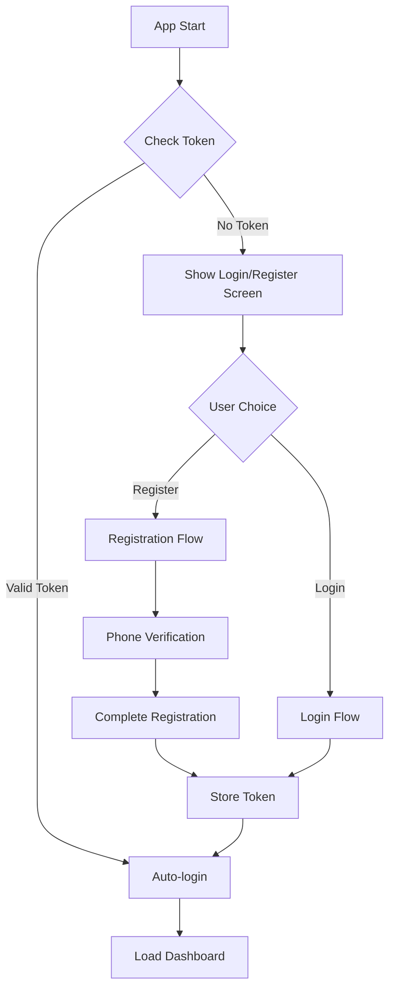
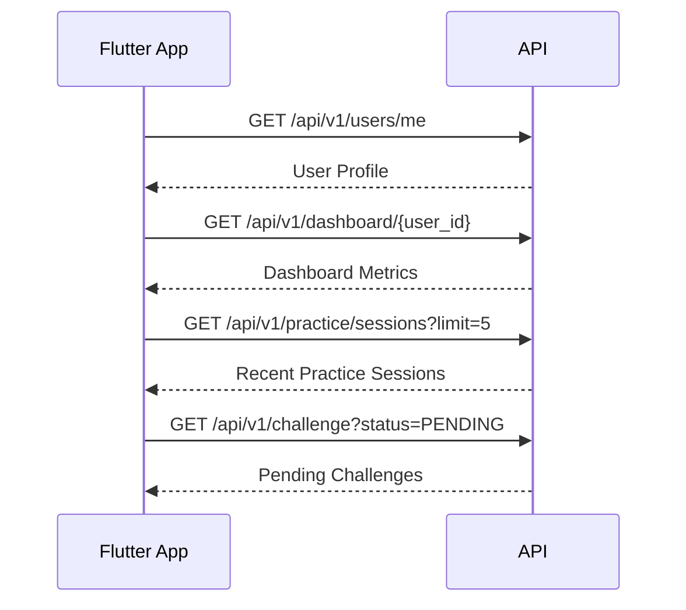
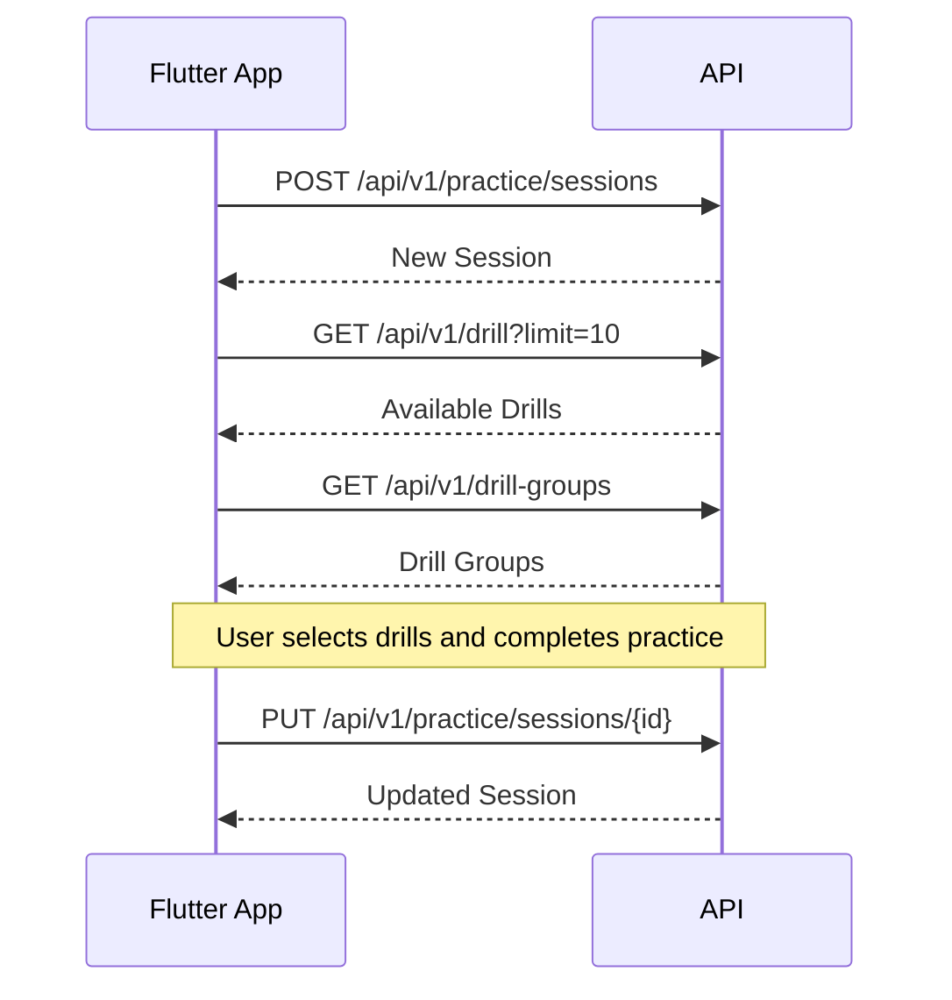
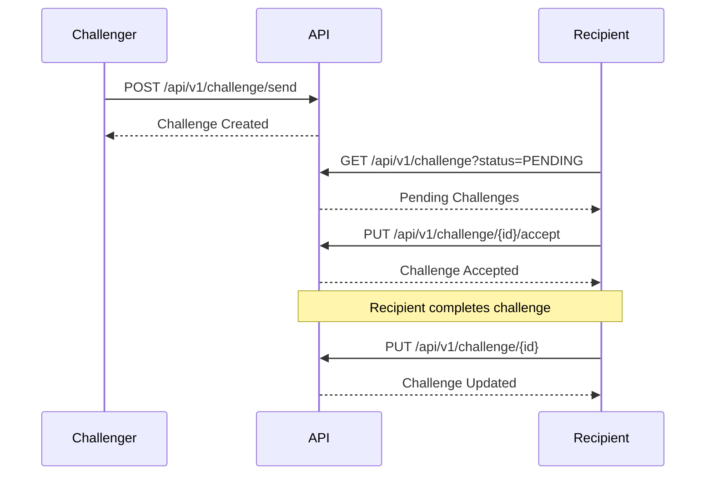

# BowlsAce Integration Workflow Guide for Flutter

This document provides a comprehensive workflow guide for integrating the BowlsAce backend API with a Flutter frontend application. It covers authentication flows, data synchronization, error handling, UI state management, and best practices.

## Table of Contents
1. [Project Setup](#project-setup)
2. [Authentication Flow](#authentication-flow)
3. [Primary Workflows](#primary-workflows)
4. [Error Handling](#error-handling)
5. [Data Synchronization](#data-synchronization)
6. [Best Practices](#best-practices)
7. [Security Best Practices](#security-best-practices)

## Project Setup

### Required Packages

For effective API integration, include the following packages in your `pubspec.yaml`:

```yaml
dependencies:
  flutter:
    sdk: flutter
  http: ^1.0.0           # For API requests
  shared_preferences: ^2.1.0  # For token storage
  provider: ^6.0.5       # For state management
  jwt_decoder: ^2.0.1    # For JWT token handling
  connectivity_plus: ^3.0.3  # For network connectivity detection
  retry: ^3.1.1          # For implementing retry logic
```

### App Architecture

For a clean and maintainable codebase, we recommend implementing a layered architecture as follows:

```
┌───────────────────────────┐
│       Presentation        │
│  (Screens, Widgets, UI)   │
└───────────┬───────────────┘
            │
┌───────────▼───────────────┐
│       Business Logic      │
│    (Providers, Blocs)     │
└───────────┬───────────────┘
            │
┌───────────▼───────────────┐
│       Repositories        │
│  (Data access abstraction)│
└───────────┬───────────────┘
            │
┌───────────▼───────────────┐
│        Data Sources       │
│     (API, Local DB)       │
└───────────────────────────┘
```

#### Comprehensive Project Structure

Below is a detailed folder structure for your Flutter project:

```
lib/
├── api/
│   ├── api_client.dart          # Base HTTP client
│   ├── api_config.dart          # API URLs and configuration
│   ├── api_error_handler.dart   # Centralized error handling
│   ├── interceptors/
│   │   ├── auth_interceptor.dart   # Adds auth token to requests
│   │   ├── logging_interceptor.dart # Logs requests and responses
│   │   └── retry_interceptor.dart   # Handles retries for failed requests
│   └── services/
│       ├── auth_api.dart        # Authentication endpoints
│       ├── challenge_api.dart   # Challenge endpoints
│       ├── dashboard_api.dart   # Dashboard metrics endpoints
│       ├── drill_api.dart       # Drill management endpoints
│       ├── drill_group_api.dart # Drill group endpoints
│       └── practice_api.dart    # Practice session endpoints
│
├── models/
│   ├── challenge.dart           # Challenge models
│   ├── dashboard.dart           # Dashboard metrics models
│   ├── drill_group.dart         # Drill group models
│   ├── drill.dart               # Drill models
│   ├── practice_session.dart    # Practice session models
│   ├── shot.dart                # Shot models
│   └── user.dart                # User and authentication models
│
├── repositories/
│   ├── auth_repository.dart     # Authentication repository
│   ├── challenge_repository.dart # Challenge repository
│   ├── drill_repository.dart    # Drill repository
│   ├── practice_repository.dart # Practice session repository
│   └── user_repository.dart     # User data repository
│
├── providers/
│   ├── auth_provider.dart       # Authentication state
│   ├── challenge_provider.dart  # Challenge state
│   ├── dashboard_provider.dart  # Dashboard state
│   ├── drill_provider.dart      # Drill state
│   ├── practice_provider.dart   # Practice session state
│   └── user_provider.dart       # User state
│
├── ui/
│   ├── screens/
│   │   ├── auth/
│   │   │   ├── login_screen.dart
│   │   │   ├── register_screen.dart
│   │   │   └── otp_verification_screen.dart
│   │   ├── challenges/
│   │   │   ├── challenge_detail_screen.dart
│   │   │   └── challenge_list_screen.dart
│   │   ├── dashboard/
│   │   │   └── dashboard_screen.dart
│   │   ├── drills/
│   │   │   ├── drill_detail_screen.dart
│   │   │   └── drill_list_screen.dart
│   │   ├── practice/
│   │   │   ├── practice_detail_screen.dart
│   │   │   └── practice_list_screen.dart
│   │   └── profile/
│   │       └── profile_screen.dart
│   │
│   ├── widgets/
│   │   ├── common/
│   │   │   ├── loading_overlay.dart
│   │   │   ├── error_dialog.dart
│   │   │   └── custom_button.dart
│   │   ├── auth/
│   │   ├── challenges/
│   │   ├── dashboard/
│   │   ├── drills/
│   │   └── practice/
│
├── utils/
│   ├── constants.dart           # App constants
│   ├── date_formatter.dart      # Date formatting utilities
│   ├── validators.dart          # Form input validators
│   ├── connectivity_service.dart # Network connectivity monitoring
│   ├── local_storage.dart       # Shared preferences wrapper
│   ├── navigation_service.dart  # Navigation utilities
│   └── secure_storage.dart      # Secure token storage
│
├── di/
│   └── service_locator.dart     # Dependency injection setup
│
└── main.dart                    # App entry point
```

### API Client Setup

```dart
class ApiClient {
  final http.Client _httpClient = http.Client();
  final TokenManager _tokenManager = TokenManager();
  final String baseUrl = 'https://your-domain.com/api/v1';
  
  Future<Map<String, String>> _getHeaders() async {
    final token = await _tokenManager.getToken();
    return {
      'Content-Type': 'application/json',
      if (token != null) 'Authorization': 'Bearer $token',
    };
  }
  
  Future<dynamic> get(String endpoint) async {
    final headers = await _getHeaders();
    final response = await _httpClient.get(
      Uri.parse('$baseUrl$endpoint'),
      headers: headers,
    );
    return _handleResponse(response);
  }
  
  Future<dynamic> post(String endpoint, dynamic data) async {
    final headers = await _getHeaders();
    final response = await _httpClient.post(
      Uri.parse('$baseUrl$endpoint'),
      headers: headers,
      body: json.encode(data),
    );
    return _handleResponse(response);
  }
  
  // Additional methods for PUT, DELETE, etc.
  
  dynamic _handleResponse(http.Response response) {
    if (response.statusCode >= 200 && response.statusCode < 300) {
      if (response.body.isEmpty) return {};
      return json.decode(response.body);
    } else if (response.statusCode == 401) {
      // Handle unauthorized - clear token and redirect to login
      _tokenManager.clearToken();
      throw UnauthorizedException('Session expired');
    } else {
      // Handle other errors
      try {
        final error = json.decode(response.body);
        throw ApiException(
          statusCode: response.statusCode, 
          message: error['detail'] ?? 'Unknown error'
        );
      } catch (e) {
        throw ApiException(
          statusCode: response.statusCode, 
          message: 'Error processing request'
        );
      }
    }
  }
}
```

## Authentication Flow

The authentication flow involves several steps that must be properly sequenced.

### 1. Initial Authentication Flow



### 2. Phone Verification Flow

Phone verification is a critical security step:

1. **Request OTP**
   - Call `POST /api/v1/auth/request-otp` with the user's phone number
   - Show OTP input field

2. **Verify OTP**
   - Call `POST /api/v1/auth/verify-otp` with phone number and entered OTP
   - If successful, proceed to account creation or login

3. **Complete Registration**
   - Call `POST /api/v1/auth/register/complete` with verified OTP and user details
   - Handle the received token and store it securely

### 3. Login Flow

```dart
Future<bool> login(String username, String password) async {
  try {
    // Show loading indicator
    _uiState.setLoading(true);
    
    // Call login API
    final response = await _authApi.login(username, password);
    
    // Store token securely
    await _secureStorage.write(key: 'access_token', value: response.accessToken);
    
    // Get current user profile
    await _fetchUserProfile();
    
    return true;
  } catch (e) {
    // Handle errors
    _errorHandler.handleAuthError(e);
    return false;
  } finally {
    // Hide loading indicator
    _uiState.setLoading(false);
  }
}
```

### 4. Token Management

```dart
class TokenManager {
  final FlutterSecureStorage _storage = FlutterSecureStorage();
  String? _cachedToken;
  
  // Get token, first from cache then from storage
  Future<String?> getToken() async {
    if (_cachedToken != null) return _cachedToken;
    _cachedToken = await _storage.read(key: 'access_token');
    return _cachedToken;
  }
  
  // Store new token
  Future<void> setToken(String token) async {
    _cachedToken = token;
    await _storage.write(key: 'access_token', value: token);
  }
  
  // Clear token on logout
  Future<void> clearToken() async {
    _cachedToken = null;
    await _storage.delete(key: 'access_token');
  }
  
  // Check if token is expired
  bool isTokenExpired() {
    if (_cachedToken == null) return true;
    try {
      final decodedToken = JwtDecoder.decode(_cachedToken!);
      final expirationDate = DateTime.fromMillisecondsSinceEpoch(decodedToken['exp'] * 1000);
      return DateTime.now().isAfter(expirationDate);
    } catch (e) {
      return true;
    }
  }
}
```

### 5. API Client with Authentication

```dart
class ApiClient {
  final http.Client _httpClient = http.Client();
  final TokenManager _tokenManager = TokenManager();
  final String baseUrl = 'https://your-domain.com/api/v1';
  
  Future<Map<String, String>> _getHeaders() async {
    final token = await _tokenManager.getToken();
    return {
      'Content-Type': 'application/json',
      if (token != null) 'Authorization': 'Bearer $token',
    };
  }
  
  Future<dynamic> get(String endpoint) async {
    final headers = await _getHeaders();
    final response = await _httpClient.get(
      Uri.parse('$baseUrl$endpoint'),
      headers: headers,
    );
    return _handleResponse(response);
  }
  
  Future<dynamic> post(String endpoint, dynamic data) async {
    final headers = await _getHeaders();
    final response = await _httpClient.post(
      Uri.parse('$baseUrl$endpoint'),
      headers: headers,
      body: json.encode(data),
    );
    return _handleResponse(response);
  }
  
  // Additional methods for PUT, DELETE, etc.
  
  dynamic _handleResponse(http.Response response) {
    if (response.statusCode >= 200 && response.statusCode < 300) {
      if (response.body.isEmpty) return {};
      return json.decode(response.body);
    } else if (response.statusCode == 401) {
      // Handle unauthorized - clear token and redirect to login
      _tokenManager.clearToken();
      throw UnauthorizedException('Session expired');
    } else {
      // Handle other errors
      try {
        final error = json.decode(response.body);
        throw ApiException(
          statusCode: response.statusCode, 
          message: error['detail'] ?? 'Unknown error'
        );
      } catch (e) {
        throw ApiException(
          statusCode: response.statusCode, 
          message: 'Error processing request'
        );
      }
    }
  }
}
```

## Primary Workflows

### 1. User Dashboard Flow



Implementation:

```dart
Future<void> loadDashboard() async {
  try {
    _uiState.setLoading(true);
    
    // Load data in parallel for better performance
    final results = await Future.wait([
      _userApi.getCurrentUser(),
      _dashboardApi.getDashboardMetrics(_userId),
      _practiceApi.getRecentSessions(limit: 5),
      _challengeApi.getPendingChallenges(),
    ]);
    
    // Update state with results
    _userProvider.setUser(results[0]);
    _dashboardProvider.setMetrics(results[1]);
    _sessionProvider.setRecentSessions(results[2]);
    _challengeProvider.setPendingChallenges(results[3]);
    
  } catch (e) {
    _errorHandler.handleError(e);
  } finally {
    _uiState.setLoading(false);
  }
}
```

### 2. Practice Session Workflow



Implementation:

```dart
class PracticeSessionService {
  final PracticeApi _practiceApi;
  final DrillApi _drillApi;
  final DrillGroupApi _drillGroupApi;
  
  // Start a new practice session
  Future<Session> startPracticeSession(SessionCreate sessionData) async {
    // Create session
    final session = await _practiceApi.createSession(sessionData);
    
    // Load relevant drills and groups
    await Future.wait([
      _loadAvailableDrills(),
      _loadDrillGroups()
    ]);
    
    return session;
  }
  
  // Complete a practice session
  Future<void> completePracticeSession(int sessionId, SessionUpdate data) async {
    await _practiceApi.updateSession(sessionId, data);
    
    // Optionally update dashboard to reflect new stats
    await _dashboardService.refreshDashboard();
    
    // Notify listeners that history should refresh
    _practiceHistoryProvider.triggerRefresh();
  }
}
```

### 3. Challenge Workflow



Implementation:

```dart
class ChallengeService {
  final ChallengeApi _challengeApi;
  final NotificationService _notificationService;
  
  // Send a challenge
  Future<void> sendChallenge(ChallengeCreate challenge) async {
    final createdChallenge = await _challengeApi.sendChallenge(challenge);
    
    // Update local state
    _challengeProvider.addSentChallenge(createdChallenge);
    
    // Show success notification
    _notificationService.showSuccess('Challenge sent successfully!');
  }
  
  // Handle incoming challenges
  Future<void> loadPendingChallenges() async {
    final challenges = await _challengeApi.getChallenges(status: 'PENDING');
    _challengeProvider.setPendingChallenges(challenges);
    
    // Show notification if there are pending challenges
    if (challenges.isNotEmpty) {
      _notificationService.showInfo('You have ${challenges.length} pending challenges');
    }
  }
  
  // Accept a challenge
  Future<void> acceptChallenge(int challengeId) async {
    await _challengeApi.acceptChallenge(challengeId);
    
    // Update local state
    await loadPendingChallenges();
    
    // Navigate to challenge details
    _navigationService.navigateTo('/challenge/$challengeId');
  }
}
```

### 4. Detailed Workflow Sequences

Below are detailed sequence diagrams for the key workflows in the BowlsAce app.

#### App Startup Sequence

```
┌─────────┐     ┌──────────┐     ┌────────────┐     ┌───────┐     ┌──────────┐
│ Flutter │     │TokenManager│     │ AuthService │     │ API   │     │ Database │
└────┬────┘     └─────┬─────┘     └─────┬──────┘     └───┬───┘     └────┬─────┘
     │                │                 │                │              │
     │  check token   │                 │                │              │
     │───────────────►│                 │                │              │
     │                │                 │                │              │
     │                │ getStoredToken  │                │              │
     │                │◄───────────────►│                │              │
     │                │                 │                │              │
     │                │  validate token │                │              │
     │                │────────────────►│                │              │
     │                │                 │                │              │
     │                │                 │  GET /users/me │              │
     │                │                 │───────────────►│              │
     │                │                 │                │              │
     │                │                 │◄───────────────│              │
     │                │                 │                │              │
     │                │◄────────────────│                │              │
     │                │                 │                │              │
     │◄───────────────│                 │                │              │
     │                │                 │                │              │
     │                │                 │                │              │
     │  if token valid: auto-login      │                │              │
     │  if token invalid: show login    │                │              │
     │                │                 │                │              │
     │  load initial data               │                │              │
     │───────────────►│                 │                │              │
     │                │                 │                │              │
     │                │                 │GET /dashboard/{id}            │
     │                │                 │───────────────►│              │
     │                │                 │                │              │
     │                │                 │◄───────────────│              │
     │                │                 │                │              │
     │                │                 │ cache data     │              │
     │                │                 │───────────────────────────────►
     │                │                 │                │              │
     │                │                 │                │              │
     │◄───────────────┴─────────────────┘                │              │
     │                                                   │              │
     │    render dashboard                               │              │
     │                                                   │              │
     └─────────────────────────────────────────────────────────────────┘
```

#### Practice Session Recording Workflow

```
┌─────────┐     ┌─────────────┐     ┌────────────┐     ┌───────┐     ┌──────────┐
│ Flutter │     │PracticeProvider│   │PracticeRepo │     │ API   │     │ Database │
└────┬────┘     └───────┬─────┐     └─────┬──────┘     └───┬───┘     └────┬─────┘
     │                   │     │           │                │              │
     │ start practice    │     │           │                │              │
     │───────────────────┼────►│           │                │              │
     │                   │     │           │                │              │
     │                   │     │ createSession              │              │
     │                   │     │───────────►│                │              │
     │                   │     │           │  POST /practice/sessions      │
     │                   │     │           │───────────────►│              │
     │                   │     │           │                │              │
     │                   │     │           │◄───────────────│              │
     │                   │     │           │                │              │
     │                   │     │◄──────────│                │              │
     │                   │     │           │                │              │
     │                   │ update state    │                │              │
     │                   │◄────┘           │                │              │
     │                   │                 │                │              │
     │◄──────────────────│                 │                │              │
     │                   │                 │                │              │
     │ record shots      │                 │                │              │
     │───────────────────┼────────────────►│                │              │
     │                   │                 │                │              │
     │                   │                 │  POST /practice/sessions/{id}/shots
     │                   │                 │───────────────►│              │
     │                   │                 │                │              │
     │                   │                 │◄───────────────│              │
     │                   │                 │                │              │
     │                   │                 │                │              │
     │ complete practice │                 │                │              │
     │───────────────────┼────────────────►│                │              │
     │                   │                 │                │              │
     │                   │                 │  PUT /practice/sessions/{id}  │
     │                   │                 │───────────────►│              │
     │                   │                 │                │              │
     │                   │                 │◄───────────────│              │
     │                   │                 │                │              │
     │                   │                 │ update local   │              │
     │                   │                 │───────────────────────────────►
     │                   │                 │                │              │
     │                   │                 │                │              │
     │                   │ update state    │                │              │
     │◄──────────────────┼─────────────────│                │              │
     │                   │                 │                │              │
     │    show results   │                 │                │              │
     │                   │                 │                │              │
     └───────────────────┴─────────────────┴────────────────┴──────────────┘
```

#### Challenge Management Workflow

```
┌─────────┐     ┌───────────────┐     ┌────────────┐     ┌───────┐ 
│ Sender  │     │ChallengeProvider│    │ChallengeRepo│    │ API   │ 
└────┬────┘     └───────┬───────┘     └─────┬──────┘     └───┬───┘ 
     │                   │                   │                │    
     │ send challenge    │                   │                │    
     │───────────────────┼───────────────────┼───────────────►│    
     │                   │                   │                │    
     │                   │                   │ POST /challenge/send
     │                   │                   │───────────────►│    
     │                   │                   │                │    
     │                   │                   │◄───────────────│    
     │                   │                   │                │    
     │◄──────────────────┼───────────────────│                │    
     │                   │                   │                │    
     │                   │                   │                │    
     │                   │                   │                │    
┌────┴────┐     ┌───────┴───────┐     ┌─────┴──────┐     ┌───┴───┐ 
│Recipient│     │ChallengeProvider│    │ChallengeRepo│    │ API   │ 
└────┬────┘     └───────┬───────┘     └─────┬──────┘     └───┬───┘ 
     │                   │                   │                │    
     │ check challenges  │                   │                │    
     │───────────────────┼───────────────────┼───────────────►│    
     │                   │                   │                │    
     │                   │                   │GET /challenge?status=PENDING
     │                   │                   │───────────────►│    
     │                   │                   │                │    
     │                   │                   │◄───────────────│    
     │                   │                   │                │    
     │◄──────────────────┼───────────────────│                │    
     │                   │                   │                │    
     │ accept challenge  │                   │                │    
     │───────────────────┼───────────────────┼───────────────►│    
     │                   │                   │                │    
     │                   │                   │PUT /challenge/{id}/accept
     │                   │                   │───────────────►│    
     │                   │                   │                │    
     │                   │                   │◄───────────────│    
     │                   │                   │                │    
     │◄──────────────────┼───────────────────│                │    
     │                   │                   │                │    
     │ complete challenge│                   │                │    
     │───────────────────┼───────────────────┼───────────────►│    
     │                   │                   │                │    
     │                   │                   │PUT /challenge/{id}
     │                   │                   │───────────────►│    
     │                   │                   │                │    
     │                   │                   │◄───────────────│    
     │                   │                   │                │    
     │◄──────────────────┼───────────────────│                │    
     │                   │                   │                │    
```

### 5. Application States and Navigation

To enable a seamless user experience, your app should handle different states with appropriate UI feedback and navigation flows:

1. **Unauthenticated State**
   - Show login/registration screen
   - Disable access to protected features
   - Store minimal data locally (e.g., last username for login convenience)

2. **Loading State**
   - Show loading indicators for API operations
   - Disable user interactions to prevent duplicate requests
   - Consider skeleton screens for better UX

3. **Authenticated State**
   - Show dashboard as the main entry point
   - Enable access to all features
   - Preload essential data (profile, recent sessions)

4. **Error State**
   - Show appropriate error messages
   - Provide retry options where applicable
   - Log errors for troubleshooting

5. **Offline State**
   - Show offline indicator
   - Enable access to cached data
   - Queue operations for when connectivity is restored

#### Navigation Structure

```
App
 ├─ Splash Screen
 │
 ├─ Authentication Flow
 │   ├─ Login
 │   ├─ Registration
 │   └─ OTP Verification
 │
 ├─ Main App (TabView)
 │   ├─ Dashboard Tab
 │   │   └─ User Statistics
 │   │
 │   ├─ Practice Tab
 │   │   ├─ Practice List
 │   │   ├─ Create Practice
 │   │   ├─ Practice Session
 │   │   └─ Practice Results
 │   │
 │   ├─ Challenges Tab
 │   │   ├─ Challenge List
 │   │   ├─ Create Challenge
 │   │   └─ Challenge Details
 │   │
 │   └─ Profile Tab
 │       ├─ User Settings
 │       └─ App Settings
 │
 └─ Drill Library (Access from Practice)
     ├─ Drill Categories
     ├─ Drill Details
     └─ Drill Groups
```

## Error Handling

Implement a consistent error handling strategy:

```dart
class ApiErrorHandler {
  final NavigationService _navigationService;
  final NotificationService _notificationService;
  
  void handleError(dynamic error) {
    if (error is ApiException) {
      switch (error.statusCode) {
        case 400:
          _notificationService.showError('Invalid data: ${error.message}');
          break;
        case 401:
          _handleUnauthorized();
          break;
        case 403:
          _notificationService.showError('You don\'t have permission to access this resource');
          break;
        case 404:
          _notificationService.showError('Resource not found: ${error.message}');
          break;
        case 422:
          _notificationService.showError('Validation error: ${error.message}');
          break;
        default:
          _notificationService.showError('Error: ${error.message}');
      }
    } else if (error is NetworkException) {
      _notificationService.showError('Network error. Please check your connection.');
    } else {
      _notificationService.showError('An unexpected error occurred');
      // Log error for debugging
      print('Unhandled error: $error');
    }
  }
  
  void _handleUnauthorized() {
    // Clear token
    TokenManager().clearToken();
    
    // Show message
    _notificationService.showWarning('Your session has expired. Please log in again.');
    
    // Navigate to login
    _navigationService.navigateToAndClear('/login');
  }
}
```

### Implementing Retries

For network-related issues, implement a retry strategy:

```dart
Future<T> retryRequest<T>(Future<T> Function() apiCall) async {
  const maxRetries = 3;
  const baseDelay = Duration(seconds: 1);
  
  return retry(
    apiCall,
    retryIf: (e) => e is NetworkException || e is TimeoutException,
    maxAttempts: maxRetries,
    delayFactor: baseDelay,
  );
}
```

## Data Synchronization

### Offline Mode Support

For better user experience, implement offline mode caching:

```dart
class PracticeRepository {
  final PracticeApi _api;
  final LocalDatabase _db;
  
  // Get sessions with offline support
  Future<List<Session>> getSessions() async {
    try {
      // Try to fetch from API
      final sessions = await _api.getSessions();
      
      // Cache the result locally
      await _db.cacheSessions(sessions);
      
      return sessions;
    } catch (e) {
      // On network error, return cached data
      if (e is NetworkException) {
        final cachedSessions = await _db.getSessions();
        
        // Show a message that we're using cached data
        NotificationService().showInfo('Showing offline data');
        
        return cachedSessions;
      }
      
      // Rethrow other errors
      rethrow;
    }
  }
  
  // Create session with offline queue
  Future<Session> createSession(SessionCreate data) async {
    try {
      // Try to create on the server
      return await _api.createSession(data);
    } catch (e) {
      if (e is NetworkException) {
        // Save to pending operations queue
        final pendingSession = await _db.savePendingSession(data);
        
        // Show message
        NotificationService().showInfo('Saved offline. Will sync when connection is restored.');
        
        return pendingSession;
      }
      rethrow;
    }
  }
  
  // Sync pending operations when online
  Future<void> syncPendingOperations() async {
    final pendingOperations = await _db.getPendingOperations();
    
    for (final op in pendingOperations) {
      try {
        switch (op.type) {
          case 'CREATE_SESSION':
            await _api.createSession(op.data);
            break;
          case 'UPDATE_SESSION':
            await _api.updateSession(op.id, op.data);
            break;
          // Handle other operation types
        }
        
        // Remove from pending queue on success
        await _db.removePendingOperation(op.id);
      } catch (e) {
        // Skip this operation but continue with others
        print('Failed to sync operation ${op.id}: $e');
      }
    }
  }
}
```

### Connectivity Monitoring

Monitor network status to trigger synchronization:

```dart
class ConnectivityService {
  final connectivity = Connectivity();
  
  Stream<bool> get onConnectivityChanged => 
    connectivity.onConnectivityChanged.map(
      (status) => status != ConnectivityResult.none
    );
  
  Future<bool> isConnected() async {
    final result = await connectivity.checkConnectivity();
    return result != ConnectivityResult.none;
  }
}

// In your app initialization
void initConnectivityMonitoring() {
  final connectivityService = ConnectivityService();
  final syncService = SyncService();
  
  connectivityService.onConnectivityChanged.listen((isConnected) {
    if (isConnected) {
      // Connection restored, start sync
      syncService.synchronizeAll();
    }
  });
}
```

## Best Practices

### 1. State Management

Use a combination of Provider and Consumer for clean state management:

```dart
// Define providers
class SessionProvider extends ChangeNotifier {
  List<Session> _sessions = [];
  bool _isLoading = false;
  
  List<Session> get sessions => _sessions;
  bool get isLoading => _isLoading;
  
  void setSessions(List<Session> sessions) {
    _sessions = sessions;
    notifyListeners();
  }
  
  void setLoading(bool loading) {
    _isLoading = loading;
    notifyListeners();
  }
}

// In UI
Widget buildSessionsList() {
  return Consumer<SessionProvider>(
    builder: (context, provider, child) {
      if (provider.isLoading) {
        return Center(child: CircularProgressIndicator());
      }
      
      if (provider.sessions.isEmpty) {
        return Center(child: Text('No sessions yet'));
      }
      
      return ListView.builder(
        itemCount: provider.sessions.length,
        itemBuilder: (context, index) {
          final session = provider.sessions[index];
          return SessionListItem(session: session);
        },
      );
    },
  );
}
```

### 2. Repository Pattern

Implement a repository pattern to abstract API calls:

```dart
class DrillRepository {
  final DrillApi _api;
  final LocalDatabase _db;
  
  Future<List<Drill>> getDrills({
    int? difficulty,
    String? search,
  }) async {
    // Try to get from API first
    try {
      final drills = await _api.getDrills(
        difficulty: difficulty,
        search: search,
      );
      
      // Cache results
      await _db.cacheDrills(drills);
      
      return drills;
    } catch (e) {
      // On failure, try local cache
      if (e is NetworkException) {
        return _db.getDrills(
          difficulty: difficulty,
          search: search,
        );
      }
      rethrow;
    }
  }
  
  // Other methods...
}
```

### 3. Dependency Injection

Use a service locator for clean dependency injection:

```dart
// Initialize services
void setupServices() {
  final getIt = GetIt.instance;
  
  // Register API services
  getIt.registerSingleton<ApiClient>(ApiClient());
  getIt.registerSingleton<AuthApi>(AuthApi(getIt<ApiClient>()));
  getIt.registerSingleton<PracticeApi>(PracticeApi(getIt<ApiClient>()));
  
  // Register repositories
  getIt.registerSingleton<AuthRepository>(AuthRepository(getIt<AuthApi>()));
  getIt.registerSingleton<PracticeRepository>(PracticeRepository(
    getIt<PracticeApi>(),
    getIt<LocalDatabase>(),
  ));
  
  // Register providers
  getIt.registerFactory<UserProvider>(() => UserProvider());
  getIt.registerFactory<SessionProvider>(() => SessionProvider());
}

// Usage in widgets
final authRepository = GetIt.instance<AuthRepository>();
```

### 4. Consistent Loading States

Implement consistent loading states across the app:

```dart
class LoadingOverlay {
  BuildContext _context;
  OverlayEntry? _overlayEntry;
  bool _isVisible = false;
  
  LoadingOverlay(this._context);
  
  void show() {
    if (!_isVisible) {
      _overlayEntry = _createOverlayEntry();
      Overlay.of(_context).insert(_overlayEntry!);
      _isVisible = true;
    }
  }
  
  void hide() {
    if (_isVisible) {
      _overlayEntry?.remove();
      _isVisible = false;
    }
  }
  
  OverlayEntry _createOverlayEntry() {
    return OverlayEntry(
      builder: (context) => Material(
        color: Colors.black54,
        child: Center(
          child: Container(
            padding: EdgeInsets.all(16.0),
            decoration: BoxDecoration(
              color: Colors.white,
              borderRadius: BorderRadius.circular(10.0),
            ),
            child: Column(
              mainAxisSize: MainAxisSize.min,
              children: [
                CircularProgressIndicator(),
                SizedBox(height: 16.0),
                Text('Loading...'),
              ],
            ),
          ),
        ),
      ),
    );
  }
}
```

### 5. API Response Models

Create strongly-typed models for all API responses:

```dart
class Session {
  final int id;
  final String name;
  final String? location;
  final String? notes;
  final int durationMinutes;
  final int userId;
  final DateTime createdAt;
  
  Session({
    required this.id,
    required this.name,
    this.location,
    this.notes,
    required this.durationMinutes,
    required this.userId,
    required this.createdAt,
  });
  
  factory Session.fromJson(Map<String, dynamic> json) {
    return Session(
      id: json['id'],
      name: json['name'],
      location: json['location'],
      notes: json['notes'],
      durationMinutes: json['duration_minutes'],
      userId: json['user_id'],
      createdAt: DateTime.parse(json['created_at']),
    );
  }
  
  Map<String, dynamic> toJson() {
    return {
      'id': id,
      'name': name,
      'location': location,
      'notes': notes,
      'duration_minutes': durationMinutes,
      'user_id': userId,
      'created_at': createdAt.toIso8601String(),
    };
  }
}
```

### 6. Security Best Practices

Implementing proper security measures is critical for protecting user data and ensuring a secure experience.

#### Secure Token Storage

Never store authentication tokens in shared preferences or local storage as plain text:

```dart
// ❌ AVOID: Insecure storage
SharedPreferences prefs = await SharedPreferences.getInstance();
await prefs.setString('token', accessToken);

// ✅ BETTER: Use flutter_secure_storage
final storage = FlutterSecureStorage();
await storage.write(key: 'token', value: accessToken);
```

#### Certificate Pinning

To prevent man-in-the-middle attacks, implement certificate pinning:

```dart
class SecureHttpClient extends http.BaseClient {
  final http.Client _inner = http.Client();
  
  @override
  Future<http.StreamedResponse> send(http.BaseRequest request) async {
    // Get certificate fingerprints
    final securityContext = SecurityContext.defaultContext;
    // Add pinned certificates
    securityContext.setTrustedCertificatesBytes(certificateBytes);
    
    // Proceed with request
    return _inner.send(request);
  }
}
```

#### API Response Validation

Always validate API responses before processing:

```dart
dynamic decodeAndValidate(http.Response response, {required JsonSchema schema}) {
  final json = jsonDecode(response.body);
  
  // Validate against schema
  final validation = schema.validate(json);
  if (!validation.isValid) {
    throw SchemaValidationException(
      'API response does not match expected schema',
      validation.errors,
    );
  }
  
  return json;
}
```

#### Secure Local Data

For sensitive local data, use encrypted databases:

```dart
// Initialize encrypted database
final encryptionKey = await getSecureKey();
final encryptedBox = await Hive.openBox('sensitiveData', 
  encryptionCipher: HiveAesCipher(encryptionKey));

// Store sensitive data
await encryptedBox.put('userPreferences', sensitiveData);
```

#### Biometric Authentication

For sensitive operations, consider using biometric authentication:

```dart
Future<bool> authenticateWithBiometrics() async {
  final localAuth = LocalAuthentication();
  
  try {
    final canCheckBiometrics = await localAuth.canCheckBiometrics;
    if (!canCheckBiometrics) {
      return false;
    }
    
    return await localAuth.authenticate(
      localizedReason: 'Authenticate to access your account',
      options: const AuthenticationOptions(
        biometricOnly: true,
        stickyAuth: true,
      ),
    );
  } catch (e) {
    print('Biometric authentication error: $e');
    return false;
  }
}
```

#### Secure API Requests

Implement an HTTPS-only policy and validate SSL certificates:

```dart
class SecureApiClient {
  HttpClient createHttpClient() {
    final client = HttpClient()
      ..badCertificateCallback = (cert, host, port) => false; // Reject bad certificates
    
    return client;
  }
}
```

#### App Security Checklist

- [ ] Implement secure token storage using platform-specific secure storage
- [ ] Set appropriate timeout for authentication tokens (match backend expiry)
- [ ] Implement certificate pinning for HTTPS connections
- [ ] Validate all API responses against expected schemas
- [ ] Sanitize all user inputs before sending to API
- [ ] Implement biometric authentication for sensitive operations
- [ ] Use encrypted local storage for sensitive data
- [ ] Clear sensitive data when user logs out
- [ ] Implement app transport security (ATS) settings in iOS
- [ ] Configure Android network security config to prevent cleartext traffic
- [ ] Regular security audits and penetration testing
- [ ] Implement jailbreak/root detection (optional)

## Monitoring and Analytics

To ensure optimal user experience and detect issues early, implement monitoring and analytics:

### Performance Monitoring

```dart
class PerformanceMonitor {
  // Track API call performance
  Future<T> trackApiCall<T>(String endpoint, Future<T> Function() apiCall) async {
    final stopwatch = Stopwatch()..start();
    try {
      final result = await apiCall();
      final duration = stopwatch.elapsedMilliseconds;
      
      // Log or report performance metric
      FirebasePerformance.instance
          .newHttpMetric(endpoint, HttpMethod.Get)
          .then((metric) async {
        metric.responsePayloadSize = _estimatePayloadSize(result);
        metric.responseContentType = 'application/json';
        metric.httpResponseCode = 200;
        await metric.start();
        metric.setResponseEndTime(DateTime.now());
        await metric.stop();
      });
      
      return result;
    } catch (e) {
      final duration = stopwatch.elapsedMilliseconds;
      
      // Log error metrics
      FirebaseCrashlytics.instance.recordError(e, StackTrace.current, 
          reason: 'API call to $endpoint failed after ${duration}ms');
      
      rethrow;
    }
  }
}
```

### Usage Analytics

Track key user interactions to improve the app experience:

```dart
class AnalyticsService {
  final FirebaseAnalytics _analytics = FirebaseAnalytics.instance;
  
  // Track screen views
  Future<void> logScreenView(String screenName) async {
    await _analytics.logScreenView(screenName: screenName);
  }
  
  // Track practice session creation
  Future<void> logPracticeSessionCreated({
    required int sessionId,
    required int durationMinutes,
    required String location,
  }) async {
    await _analytics.logEvent(
      name: 'practice_session_created',
      parameters: {
        'session_id': sessionId,
        'duration_minutes': durationMinutes,
        'location': location,
      },
    );
  }
  
  // Track challenge interactions
  Future<void> logChallengeAction({
    required int challengeId,
    required String action,
  }) async {
    await _analytics.logEvent(
      name: 'challenge_action',
      parameters: {
        'challenge_id': challengeId,
        'action': action, // 'send', 'accept', 'decline', 'complete'
      },
    );
  }
}
```

## Conclusion

By following this integration guide, your Flutter application will effectively communicate with the BowlsAce backend API, providing a seamless user experience with proper error handling, offline support, and clean architecture. The workflows described cover the primary user interactions required by the application, ensuring that all necessary data is available when needed and properly synchronized with the server.
